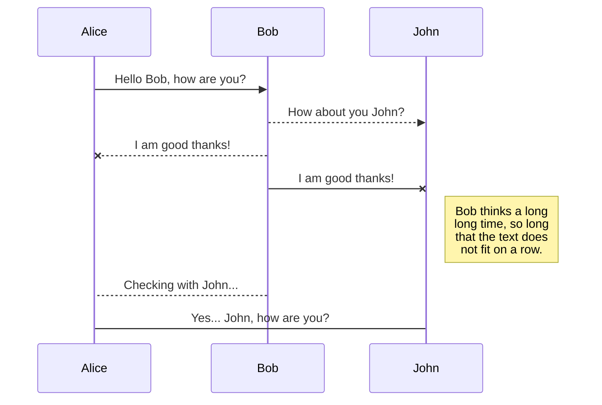
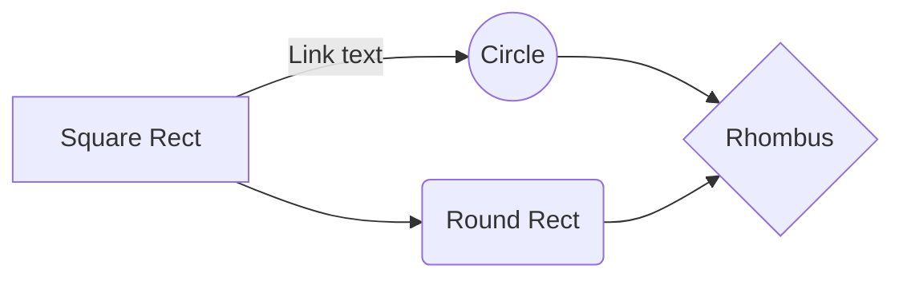

# Triple Integral calculator

##  Table of Contents

- [File Management](#file-management)
- [Usage](#table-of-contents)
- [Underlying theory](#underlying-theory)
	- [Mathematical Formulation of the Problem](#mathematical-formulation-of-the-problem)
	- [Numerical Solution](#numerical-solution)
# File Management
Triple Integral calculator
```
│
├── bin // executable 
│ └── main
├── doc // documentation 
├── include // headers (.h)
│ ├── error.h
│ ├── linker.h
│ ├── main.h
│ └── math3D.h 
├── lib // library build directory (.o)
├── src // general sources (.cpp)
│ ├── linker.cpp
│ ├── main.cpp
│ └── math3D.cpp
├── test
│ └── function.cpp 
├── Makefile
└── README.md
```
# Usage

# Underlying theory
## Mathematical Formulation of the Problem
The objective of the program is to numerically approximate(with a certain error) the value that would assume the corresponding Lesbegue integration.
We have that the value of the integral is equal to the measure of the volume of the surface. In other words, given a function $f(x,y,z):D\subseteq \mathbb{R}^3 \rightarrow \mathbb{R}^3$, being $D$ a normal regular domain, we have.
$$\iiint_D f(x,y,z)dD = m_{4}(S_f)$$
The function $f$ is provided from the user, and it's supposed that the function has an integral(this means it can also be $\pm\infty$).
The domain $D$ is also given as input, in the form of the intersection of two inequalities of the form $Ax^2+ax+By^2+by+Cz^2+cz+r\gtreqless0$. From this we can see that the border is given by the intersection of two $C^{\infty}(\mathbb{R}^3)$ functions, and thus is also normal and regular.

At this point the aim of the program is to just approximate the value of $m_4(S_f)$(where by $m_4$ it's to be intended the 4D measure function).

It must be also mentioned that the domain can be unbounded, in this case an estimate of the improper integral is given.
## Numerical Solution
The method used to solve the problem relies on romberg integration method. 
### Domain
But let's begin by looking at the domain of integration.
Given that the domain is the intersection of two inequalities of the form $Ax^2+ax+By^2+by+Cz^2+cz+r\gtreqless0$. What we do is find the maximum and minimum value assumed by $x,y$ and $z$. After finding each max and min value we look for common intervals. This way we get a rectangular set that contains the domain $D$.
The only thing to do is calculate the values assumed by each coordinate. Let's do the calculations for $x$, and for the others follows with the same logic.

- Case $A,B,C\neq0$:

	The first thing we want to do is rewriting the inequality as $Ax^2+ax+(\sqrt{B}y+\frac{b}{2\sqrt{B}})^2-\frac{b^2}{4B}+(\sqrt{C}y+\frac{c}{2\sqrt{C}})^2-\frac{c^2}{4C}+r\gtreqless0$ by completing the squares. We can see that with a proper choice of $y$ and $z$ we can make their squares $0$. In addition we can also impose the inequality to be $>$ or $\geq$ by changing accordingly the signs of all the coefficients(let's say it's $>$).
	So, evaluating the inequality at such $\tilde{y},\tilde{z}$ we get $Ax^2+ax-\frac{b^2}{4B}-\frac{c^2}{4C}+r>0$. We define $k \equiv -\frac{b^2}{4B}-\frac{c^2}{4C}+r$, such that we have $Ax^2+ax+k>0$.
	At this point we solve for x, getting $x=\frac{-a\pm\sqrt{a^2-4Ak}}{2A}$. By studying the discriminant and the sign of A we can get different solutions:
	- $A>0$
		- $a^2-4Ak\geq 0 \Rightarrow x \in (-\infty,\frac{-a-\sqrt{a^2-4Ak}}{2A}) \cup (\frac{-a+\sqrt{a^2-4Ak}}{2A},+\infty)$, but since we want the max and min we get $(-\infty,+\infty)$
		- $a^2-4Ak< 0$ since we want where the parable is above $0$, and it doesn't cross $0$, we have that every value satisfy the equation, and thus $x \in (-\infty,+\infty)$.
	- $A<0$
		- $a^2-4Ak\geq 0 \Rightarrow x \in (\frac{-a-\sqrt{a^2-4Ak}}{2A},\frac{-a+\sqrt{a^2-4Ak}}{2A})$
		- $a^2-4Ak< 0$, this time it has no solutions but the parable is below $0$, and thus we have no solutions.
- Case $A=0 \land B,C\neq0$:

	We can follow the same steps as before, ending up with the inequality $ax+k>0$. Here we have two cases:
	- $a>0$ that gives us $x>\frac{k}{a}$
	- $a<0$ that gives us $x<\frac{k}{a}$

	Also, we can consider here the case $a=0$. This is either always true if $k>0$, or always false.
- Case $A,B\neq0 \land C=0$ (same goes for $A,C\neq0 \land B=0$):
	Our inequality reduces to $Ax^2+ax+(\sqrt{B}y+\frac{b}{2\sqrt{B}})^2-\frac{b^2}{4B}+cz+r>0$, where I already swapped signs to the coefficients in order to always get the $>$ or $\geq$ case. If $c\neq0$ we have that the term $cz$ can assume all real numbers, thus compensating for every possible value of $Ax^2+ax$. So with $c\neq0$ we have $x \in (-\infty,+\infty)$.
	The case $c=0$ gives us instead $Ax^2+ax+(\sqrt{B}y+\frac{b}{2\sqrt{B}})^2-\frac{b^2}{4B}+r>0$. This is very similar to the one analyzed in the first point. We can define $k\equiv-\frac{b^2}{4B}+r$, and under the same considerations as before we get similar results for $Ax^2+ax+k>0$.
- Case $A,C=0 \land B\neq0$ (same goes for $A,B=0 \land B\neq0$):

	Again we follow the same steps as before, ending up with $ax+k>0$. To be noted that this is the second definition $k$, but symbolically has the same solutions as the second case.
- Case $A,B,C=0$:

	The inequality is reduced to $ax+by+cz+r>0$. Here if either $b=0$ or $c=0$ we have that the term can assume values from $-\infty$ to $+\infty$, meaning that the $x$ too can assume all these values.
	To be noted that the case $a=0$ with either $b\neq0 \lor c=0$ gives an inequality of type $by+r>0$ for example. This doesn't depend on $x$, and can be verified for certain $y$, thus it can assume all values of $x$.
	Concluding, we have to watch the case $b,c=0$ with and without $a\neq0$.
	So, if $a\neq0$ we have $ax+r>0$. This again has the same solutions discussed for the inequality of type $ax+k>0$.
	Let's finally watch the last case, where $a=0$. The inequality has constant truth value, and is $r>0$. This is either always true or false for every $x$.

### Romberg's method + Richardson's Extrapolation
Having established a domain the next step is actually calculating the integral using Romberg's algorithm. It goes as following:
The first column $R_{i,1} \forall i\geq1$ is given by the 3D trapezoidal rule.
The rule is implemented as follows:


We compute a regular trapezoid rule over the x axis on the red dots. Each red dot is the result of a regular trapezoidal rule over the y axis(the red lines). And each blue(or red) dot is again the result of a regular trapezoidal rule over the z axis(the blue lines). The regular trapezoidal rule is:
$$R_{i,1} = \frac{h}{2}[f(a)+2\sum\limits_{k=1}^{2^{i}-1} f(a+kh)+f(b)]$$
with $h$ the step-size. The reason why the upper limit of the sum is $2^{i}-1$ is because by construction we always halve h each step.

At this point to get the next values in each row we take advantage of Richardson's Extrapolation. This formula cancels the error contributes, making each step more precise. In particular the error of $R_{i,j}$ is of $O(h^{2j})$. The way we cancel the contributes is given by the following relation $R_{i,j}=\frac{4^{j-1}R{i,j-1}-R_{i-1,j-1}}{4^{j-1}-1}$.
This is thus how we proceed in filling the table of approximations.


To estimate the error we can watch two consecutive values of R, such that $\epsilon \equiv |R_{i,j}-R_{i,j-1}|$.


# Synchronization

Synchronization is one of the biggest features of StackEdit. It enables you to synchronize any file in your workspace with other files stored in your **Google Drive**, your **Dropbox** and your **GitHub** accounts. This 

- The workspace synchronization will sync all your files, folders and settings automatically. This will allow you to fetch your workspace on any other device.
	> To start syncing your workspace, just sign in with Google in the menu.

- The file synchronization will keep one file of the workspace synced with one or multiple files in **Google Drive**, **Dropbox** or **GitHub**.
	> Before starting to sync files, you must link an account in the **Synchronize** sub-menu.

###  StarterKit Files

```


```


## Publish a File

You can publish your file by opening the **Publish** sub-menu and by clicking **Publish to**. For some locations, you can choose between the following formats:

- Markdown: publish the Markdown text on a website that can interpret it (**GitHub** for instance),
- HTML: publish the file converted to HTML via a Handlebars template (on a blog for example).

## Update a publication

After publishing, StackEdit keeps your file linked to that publication which makes it easy for you to re-publish it. Once you have modified your file and you want to update your publication, click on the **Publish now** button in the navigation bar.

> **Note:** The **Publish now** button is disabled if your file has not been published yet.


# Markdown extensions

StackEdit extends the standard Markdown syntax by adding extra **Markdown extensions**, providing you with some nice features.

> **ProTip:** You can disable any **Markdown extension** in the **File properties** dialog.


## SmartyPants

SmartyPants converts ASCII punctuation characters into "smart" typographic punctuation HTML entities. For example:

|                |ASCII                          |HTML                         |
|----------------|-------------------------------|-----------------------------|
|Single backticks|`'Isn't this fun?'`            |'Isn't this fun?'            |
|Quotes          |`"Isn't this fun?"`            |"Isn't this fun?"            |
|Dashes          |`-- is en-dash, --- is em-dash`|-- is en-dash, --- is em-dash|


## KaTeX

You can render LaTeX mathematical expressions using [KaTeX](https://khan.github.io/KaTeX/):

The *Gamma function* satisfying $\Gamma(n) = (n-1)!\quad\forall n\in\mathbb N$ is via the Euler integral

$$
\Gamma(z) = \int_0^\infty t^{z-1}e^{-t}dt\,.
$$

> You can find more information about **LaTeX** mathematical expressions [here](http://meta.math.stackexchange.com/questions/5020/mathjax-basic-tutorial-and-quick-reference).


## UML diagrams

You can render UML diagrams using [Mermaid](https://mermaidjs.github.io/). For example, this will produce a sequence diagram:



And this will produce a flow chart:


